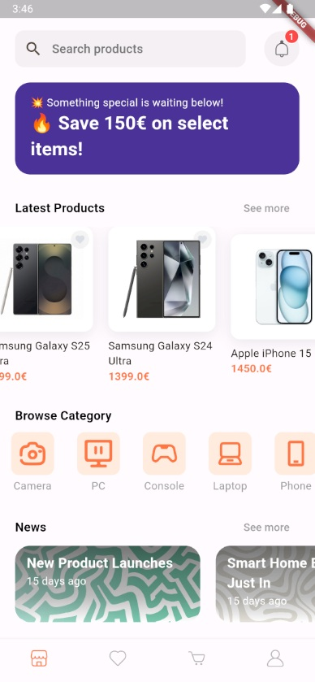
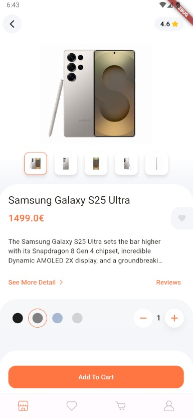

# 🛒 Electronics Shop #
## 🚧 Work In Progress 🚧 ## 
### 🚀🧪 Demo Project 🧪🚀 ###
A multi-platform demo project for an electronics shop.
### 📸 App Screenshots ###
Rest of the screenshots can be found in the <a href="https://github.com/eldin17/Electronics_Shop/tree/main/app_screenshots">app_screenshots</a> folder. (All currently working parts of the project).

    
  

### This application consists of: ###

📱 Mobile App – Built with Flutter

🖥️ Desktop App – Built with Flutter

🌐 Web App – Built with Angular

### Tech Stack ###
🧠 C# / .NET – Backend API

📱 Flutter – Mobile and Desktop App

🌐 Angular – Web App

🗄️ SQL – Relational Database

🧬 Entity Framework – ORM

📨 RabbitMQ – Message Brokering, Mail Sending

🐳 Docker – Containerization