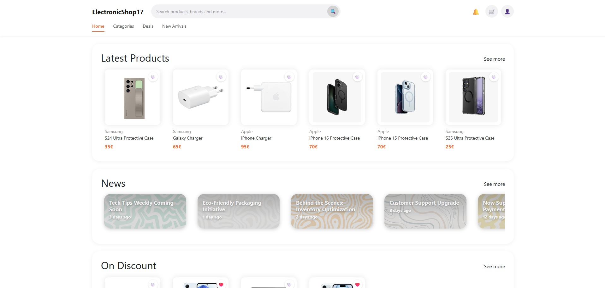

# 🛒 Electronics Shop #
## 🚧 Work In Progress 🚧 ## 
### 🚀 Demo Project 🚀 ###
A multi-platform demo project for an electronics shop.
Implementing features such as product management, JWT user authentication, Redis blacklist,
order processing, discounts, coupons, AI product recommendation system (ML.NET), 
reviews, AI summary, online payments, webhook-driven order processing, SignalR notifications, interactive UI, 
Docker containers, automated email notifications.
### 📸 App Screenshots ###
Rest of the screenshots can be found in the <a href="https://github.com/eldin17/Electronics_Shop/tree/main/app_screenshots">app_screenshots</a> folder. (All currently working parts of the project)

    
  

      

### This application consists of ###

📱 Mobile App – Built with Flutter

🖥️ Desktop App – Built with Flutter

🌐 Web App – Built with Angular

### Tech Stack, Features & Integrations  ###
🧠 C# / .NET – Backend API

📱 Flutter – Mobile and Desktop App

🌐 Angular – Web App

🗄️ SQL – Relational Database

🧬 Entity Framework – ORM

🔒 JWT Authentication – Utilizing Access and Refresh Tokens for seamless session management

🗄️ Redis – Utilized as a high-performance cache and real-time JWT Blacklist for secure, immediate session revocation, and AI summary

🤖 ML.NET – Co-purchase recommendations using Matrix Factorization on order history, with a category-based fallback mechanism

🔮 Ollama – Self-hosted Local LLM integration for automated product review summarization

📨 RabbitMQ – Message Brokering, Mail Sending

🐳 Docker – Containerization

💳 Stripe – Secure payments with webhook-driven order processing

📡 SignalR – Real-time web functionality for instant notifications and UI updates.